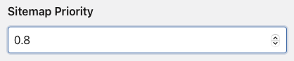

# Kirby 3 Multilanguage XML Sitemap Plugin

Is a powerful tool for managing and generating sitemaps that is designed to work with [Kirby 3](https://getkirby.com). This plugin provides a straightforward approach for creating XML Sitemaps, especially for sites with multiple languages. The multilingual support allows you to create separate URLs for each language, increasing the SEO performance of your website. The plugin creates one XML file with URLs to your website pages and images, automagically ✨ assigning their priority and last modification date which can be later easily readed by search engines.

If the website has only one language, a sitemap is generated in `/sitemap.xml`.
With this new version (0.2.0), if the site has two or more languages, a `<sitemapindex>` is generated in `sitemap.xml` and all sub-sitemaps for each language with the following scheme: `sitemap_en.xml`, `sitemap_es.xml`, etc

****
## How to install

### Download

[Download and copy this repository](https://github.com/isaactopo/xmlsitemap/archive/main.zip) to /site/plugins/xmlsitemap

### As a Git Submodule
```git submodule add https://github.com/isaactopo/xmlsitemap.git site/plugins/xmlsitemap```

### With Composer
```composer require isaactopo/xmlsitemap```

## Setup

The plugin works from the start, outputting all the listed pages from your website on `yoursite/sitemap.xml` and redirecting `yoursite/sitemap` to `yoursite/sitemap.xml`

## Options and configuration
The plugin has 3 config options that you can tweak from your `site/config.php` file:

### 🙈 Ignore Pages
By default not listed pages are Ignored, but sometimes you will want to ignore specific pages. You are able to do it with:
```php
'isaactopo.xmlsitemap.ignore' => ['error', 'legal'],
```
### 🎆 Include Images
You can inlude images with:
```php
'isaactopo.xmlsitemap.includeImages' => true,
```
### 🧾 Include Specific Pages
If you have some factory-generated pages from your Routes or another page that you want to force-include you can do it with:
```php
'isaactopo.xmlsitemap.addCollection' => function () {
    $professionals = kirby()->users()->filterBy('publish', true);
    $profiles = [];
    foreach($professionals as $professional){
        $profiles[] = Page::factory([
            'slug' => 'team/'.$professional,
            'template' => 'profile',
            'content' => [
                'author' => $professional,
                ]
            ]);
        }
    return $profiles;
},
```
### 🛗 Change Page Priority
The plugin generates an automatic priority according to the depth of each page (Thanks Bastian). But you may want to change the priority of some pages by hand. If so, you can do it by creating a new field in the blueprint of the page you want to include:
```yaml
sitemapPriority:
    label: Sitemap Priority
    type:  number
    width: 1/2
    max:   1
    min:   0
    step:  0.1
```


This way the plugin will prioritise the input from the Panel.

## Credits

- Isaac Bordons <https://topo.bz> — <https://morethanlaw.es>
- Thanks to [Bastian Allgeier](https://github.com/bastianallgeier) for [his article on the Cookbook](https://getkirby.com/docs/cookbook/content/sitemap) and [Pedro Borges](https://github.com/pedroborges) for his [K2 XML Sitemap plugin](https://github.com/pedroborges/kirby-xml-sitemap)
